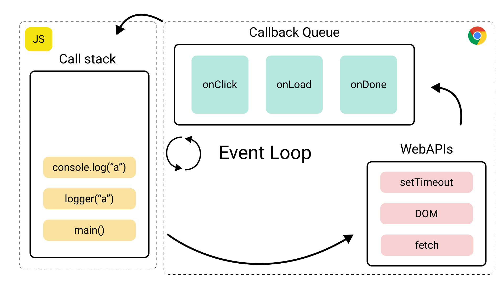

### **What is Node.js?**

**Node.js** is a runtime environment built on Chrome's **V8 JavaScript engine** that allows us to run JavaScript code outside of the browser. Unlike traditional server-side languages (e.g., PHP, Python), Node.js enables JavaScript to be used for both client-side and server-side development. It is widely used for building scalable network applications and is especially popular in web development due to its non-blocking, event-driven architecture.

Key features of Node.js:
- **Asynchronous and Event-Driven**: Node.js uses an event-driven, non-blocking I/O model, making it lightweight and efficient for building real-time applications.
- **Single-Threaded**: Node.js operates on a single-threaded event loop, which makes it different from traditional server architectures that use multiple threads to handle requests.
- **Fast Performance**: Node.js uses the V8 engine, which is highly optimized for speed and performance, making it a fast runtime for executing JavaScript code.
- **Non-Blocking I/O**: Node.js can handle many concurrent operations without being blocked by slower tasks like file I/O, network operations, or database queries.
- **Cross-Platform**: It can be used to develop applications that run on various platforms such as Linux, Windows, and macOS.

### **What is the Event Loop in Node.js?**

The **Event Loop** is a core concept in Node.js that handles the execution of non-blocking I/O operations, ensuring that Node.js can handle multiple operations concurrently without blocking the main thread. Since JavaScript is single-threaded, Node.js uses the event loop to perform non-blocking operations and manage multiple I/O tasks efficiently.

How the event loop works:

1. **Phases of the Event Loop**: The event loop runs in multiple phases, where different types of callbacks are executed. The key phases are:
   - **Timers**: Executes callbacks scheduled by `setTimeout` and `setInterval`.
   - **I/O Callbacks**: Executes callbacks for completed I/O operations like file reads, HTTP requests, etc.
   - **Idle, Prepare**: Internal Node.js operations.
   - **Poll**: Waits for new events or callbacks to be added to the event queue.
   - **Check**: Executes `setImmediate()` callbacks.
   - **Close Callbacks**: Executes callbacks for closed resources.

2. **Non-blocking and Asynchronous**: If a function involves I/O (e.g., reading a file, querying a database), Node.js will delegate the operation to the system kernel and continue executing other tasks. Once the I/O operation completes, the callback function is added to the event queue and executed when the event loop is ready.

3. **Single-Threaded**: While the event loop is single-threaded, Node.js uses libuv (a C library) to manage concurrency with multiple threads for I/O operations behind the scenes. This allows Node.js to handle multiple requests at the same time without blocking the event loop.

### **How Does Node.js Work Underneath?**

Node.js operates on a **single-threaded event-driven architecture**. The key components involved in how it works are:

1. **V8 JavaScript Engine**: The V8 engine, developed by Google, is responsible for executing JavaScript code. It compiles JavaScript into machine code for faster execution.

2. **libuv**: libuv is a multi-platform support library that abstracts asynchronous I/O operations, enabling Node.js to use multiple threads for I/O tasks. It is responsible for the event loop, thread pool management, and managing async callbacks.

3. **Event Loop**: As discussed, the event loop is at the heart of Node.js. It is the process that picks up events from the event queue, processes them, and ensures that the application remains non-blocking.

4. **Thread Pool**: Node.js uses a thread pool to handle operations that are CPU-intensive or require system-level concurrency (e.g., file system operations, DNS resolution). These operations are offloaded to the thread pool while the main event loop continues processing other tasks.

5. **Callback Queue**: Asynchronous operations add their callbacks to the callback queue, and the event loop picks them up and executes them one by one when the call stack is empty.

### **The MERN Stack**

The **MERN stack** is a set of technologies used for building modern web applications, and it includes:

- **MongoDB**: A NoSQL database that stores data in JSON-like documents. It is known for its flexibility and scalability.
- **Express.js**: A web application framework for Node.js that simplifies the creation of APIs and handling HTTP requests.
- **React.js**: A JavaScript library for building user interfaces, typically for single-page applications. React allows you to create reusable components and efficiently update the UI.
- **Node.js**: The runtime environment that runs the server-side code using JavaScript.

In a MERN stack application, all components are written in JavaScript, making it easier for developers to manage both frontend and backend code. It's a full-stack development framework where MongoDB handles data storage, Express.js and Node.js manage the server-side, and React.js handles the frontend.

### **Why Should We Learn Node.js If We Are Starting Out in Backend Development?**

1. **Single Language for Both Frontend and Backend**: With Node.js, you can use JavaScript on both the client-side (in the browser) and the server-side. This simplifies development because you don't need to switch between different languages for backend and frontend development. If you already know JavaScript, learning Node.js for backend development becomes much easier.

2. **Non-Blocking, Asynchronous Model**: Node.js's asynchronous, non-blocking architecture allows you to build fast and scalable applications, especially for I/O-heavy tasks like reading/writing files, making API calls, and interacting with databases. This is crucial for building modern web applications and services that need to handle thousands of concurrent users.

3. **Active and Large Ecosystem**: Node.js has a large ecosystem of libraries and modules available through **npm** (Node Package Manager), which can help solve almost any problem you encounter while building a backend. You can use libraries for authentication, data validation, working with databases, or even implementing real-time features like chat.

4. **Real-Time Applications**: Node.js is particularly suited for building real-time applications, such as chat applications, live notifications, and collaborative platforms. Its event-driven nature and support for WebSockets make it easy to manage real-time, bidirectional communication between clients and servers.

5. **Performance**: Thanks to the V8 engine and Node.js's non-blocking event loop, it can handle a high number of concurrent requests with relatively low resource usage. This makes it a great choice for building scalable applications.

6. **Learning Curve**: If you are already familiar with JavaScript, learning Node.js for backend development is easier compared to other server-side technologies. It also encourages an understanding of asynchronous programming, which is a valuable skill in modern web development.

7. **Job Market Demand**: Node.js has become one of the most popular technologies for building backend applications, and many companies prefer developers who are proficient in Node.js. As a backend developer, learning Node.js can significantly enhance your job prospects.

8. **Community and Support**: Node.js has a large, active community of developers. This means you can find plenty of resources, tutorials, and open-source projects to help you learn and solve any challenges you face.

### **Conclusion**

Node.js is a powerful runtime that enables JavaScript to be used for backend development. Its event-driven, non-blocking architecture allows it to handle many concurrent operations, making it ideal for building fast, scalable, and real-time applications. By learning Node.js, we can take advantage of JavaScript’s versatility and use it across both frontend and backend development, all while tapping into a vast ecosystem of libraries and frameworks (like Express.js and MongoDB) to build full-stack applications.

The **MERN stack** is a modern development framework that combines MongoDB, Express, React, and Node.js to build full-stack applications using only JavaScript. For backend development, Node.js provides an excellent platform, especially for handling real-time applications, scalable APIs, and high-concurrency systems. Whether you're building a simple web app or a complex microservices architecture, Node.js offers the flexibility and performance needed to succeed in backend development.



The **Event Loop** is one of the most fundamental aspects of **Node.js** and JavaScript in general, especially when it comes to handling asynchronous operations in a single-threaded environment. The event loop enables Node.js to perform non-blocking I/O operations, which makes it possible for Node.js to handle many operations concurrently while using a single thread. Let's dive into how the event loop works and break it down in great depth.

### **Overview of the Event Loop**

The **event loop** is responsible for executing all JavaScript code in Node.js. It allows JavaScript to perform non-blocking asynchronous operations such as reading files, making network requests, or querying a database while still being able to respond to other events. The key feature of the event loop is that it enables the single-threaded nature of Node.js to handle multiple tasks concurrently without blocking the execution of other code.

#### **How the Event Loop Works**

The event loop operates by continuously checking the event queue (also known as the message queue or callback queue) and the call stack to determine which code to execute. When asynchronous tasks are completed, their callbacks are placed in the event queue, and the event loop will eventually execute these callbacks when the call stack is empty.

The event loop works in a series of steps or phases. Let's break them down:

### **Phases of the Event Loop**

The event loop executes a sequence of phases, each designed to handle a specific type of operation. These phases ensure that different tasks (such as timers, I/O operations, and immediate callbacks) are handled in an appropriate order. The major phases of the event loop are:

1. **Timers Phase**: This is the first phase of the event loop. During this phase, Node.js executes the callbacks for any timers that have expired. For example, if you have set a `setTimeout` or `setInterval` function, its callback will be added to the event queue when the timer has completed.

    - **setTimeout**: Executes after the specified delay (in milliseconds).
    - **setInterval**: Executes repeatedly at a specified interval.

    However, note that even though the timers have expired, they don't immediately execute their callbacks. The event loop ensures they are only executed after the current phase completes and the call stack is empty.

2. **I/O Callbacks Phase**: In this phase, Node.js executes most of the I/O callbacks. These are the callbacks for operations such as file system reads, network requests, and database queries. The I/O phase deals with all asynchronous operations that are part of the event-driven nature of Node.js.

3. **Idle, Prepare Phase**: This is an internal phase used by Node.js for internal operations, which are not part of user-facing APIs. It is used by the runtime to prepare the event loop for the next iterations.

4. **Poll Phase**: The poll phase is the most important phase, and it’s where the event loop spends most of its time. During this phase, Node.js will check if there are any events or I/O tasks that need to be processed. If there are pending events, their callbacks will be moved to the event queue. If no events are pending, the event loop will check for new events or continue to idle.

    - If the callback queue is not empty, the event loop will process the callbacks from the event queue.
    - If there are no callbacks to process, Node.js may choose to wait for new events or simply move on to the next phase.

5. **Check Phase**: In this phase, Node.js executes any callbacks scheduled by `setImmediate()`. These are callbacks that are intended to run immediately after the current phase completes. The **setImmediate** function is specifically designed for callbacks that should execute after the poll phase but before the next event loop iteration.

6. **Close Callbacks Phase**: In this phase, Node.js executes callbacks for closed resources. For example, when a connection is closed (e.g., a network socket or file stream), the event loop will process the corresponding callback in this phase.

### **The Call Stack and Event Queue**

The event loop interacts closely with the **call stack** and the **event queue**.

#### **Call Stack**
The call stack is where all the function calls are placed during the execution of JavaScript code. Each time a function is called, it is added to the top of the call stack. Once the function finishes executing, it is popped off the stack. If the call stack is not empty, the event loop will not proceed to the next phase because it has to finish executing the current functions first.

The call stack is **synchronous**, meaning that if a function in the stack is blocking (e.g., synchronous I/O), it will halt the execution of subsequent tasks in the event loop until it finishes executing.

#### **Event Queue (Message Queue)**
The event queue is where callbacks (from asynchronous tasks) are placed after they are completed. These tasks could be I/O operations, timers, or other events that have been queued up. When the call stack is empty, the event loop will check the event queue and process the next callback from the queue.

The event queue is **asynchronous**, which means that tasks placed in the queue will be executed in the order they were received.

### **How Asynchronous Operations Work with the Event Loop**

In Node.js, when an asynchronous operation like reading a file or making an HTTP request is initiated, it is offloaded to the system's kernel or a worker thread (handled by libuv). Once the operation is completed, the corresponding callback is pushed onto the event queue, and the event loop will pick it up and execute it once the call stack is empty.

### **Example: A Practical Flow of the Event Loop**

Consider the following code example:

```javascript
console.log("Start");

setTimeout(() => {
  console.log("Inside setTimeout");
}, 0);

setImmediate(() => {
  console.log("Inside setImmediate");
});

console.log("End");
```

**Step-by-step execution flow:**

1. `"Start"` is printed synchronously (call stack).
2. `setTimeout` is called, but its callback is added to the event queue after the specified delay (0 ms). The `setTimeout` callback will be executed in the **Timers phase**.
3. `setImmediate` is called, and its callback is added to the event queue to be executed in the **Check phase**.
4. `"End"` is printed synchronously (call stack).
5. The call stack is now empty, so the event loop moves to the **Timers phase** and executes the `setTimeout` callback (`"Inside setTimeout"`).
6. The event loop then moves to the **Check phase** and executes the `setImmediate` callback (`"Inside setImmediate"`).

In this case, even though `setTimeout` had a delay of 0 ms, its callback was executed before `setImmediate`, showing how Node.js schedules tasks based on the event loop phases.

### **The Importance of the Event Loop in Node.js**

The event loop is what makes Node.js highly performant and scalable. It allows Node.js to handle large numbers of concurrent operations (like handling thousands of HTTP requests) without blocking the thread. By using asynchronous I/O operations, Node.js can initiate tasks without waiting for them to complete, enabling it to process many tasks in parallel (not in the traditional multi-threaded sense but in an efficient way).

Without the event loop, Node.js would need to rely on multiple threads, which could introduce significant overhead and complexity, especially when dealing with I/O operations.

### **Conclusion**

In Node.js, the **event loop** is the mechanism that allows non-blocking, asynchronous code execution to be handled efficiently in a single-threaded environment. It cycles through various phases (Timers, I/O Callbacks, Poll, Check, and Close Callbacks) to manage the execution of callbacks. The event loop, in conjunction with the call stack and event queue, enables Node.js to perform many tasks concurrently, without blocking the execution of other code. By understanding how the event loop works, developers can write more efficient and scalable applications, especially when dealing with high-concurrency tasks.